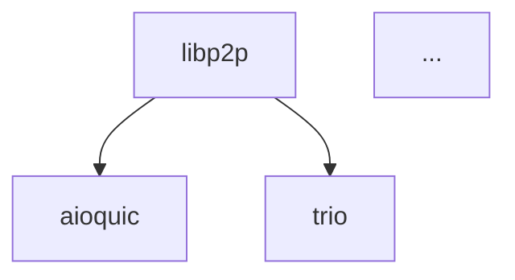

# Dependency Graph for py-libp2p

This directory contains automatically generated dependency graphs for the py-libp2p project.

## Files

### Direct Dependencies (First-Level Only)

- **`dependencies.json`**: Machine-readable JSON format with nodes and edges representing direct dependencies only
- **`dependencies.dot`**: Graphviz DOT format for visualization
- **`dependencies.mmd`**: Mermaid format for rendering in Markdown documents (e.g., GitHub)
- **`dependencies.md`**: Human-readable summary of all dependencies
- **`dependencies.png`**: Visual PNG image of direct dependencies
- **`dependencies.svg`**: Visual SVG image of direct dependencies

### Transitive Dependencies (Full Dependency Tree)

- **`dependencies_transitive.json`**: Machine-readable JSON format showing ALL dependencies including transitive ones
- **`dependencies_transitive.dot`**: Graphviz DOT format showing full dependency tree with interconnections
- **`dependencies_transitive.mmd`**: Mermaid format showing full dependency tree
- **`dependencies_transitive.png`**: Visual PNG image of full dependency tree
- **`dependencies_transitive.svg`**: Visual SVG image of full dependency tree

## Key Difference

- **Direct dependencies**: Shows only what py-libp2p directly depends on (star-shaped graph, all packages connect to libp2p)
- **Transitive dependencies**: Shows the complete dependency tree including dependencies of dependencies (shows interconnections between packages)

## Generating the Graphs

### Direct Dependencies Only

```bash
python3 scripts/oso/generate_dependency_graph.py
```

### Full Transitive Dependency Tree

```bash
python3 scripts/oso/generate_transitive_dependency_graph.py
```

The scripts analyze `pyproject.toml` and generate all formats automatically.

## Usage

### JSON Format

The JSON format can be used with dependency analysis tools and custom dashboards:

```json
{
  "project": {
    "name": "libp2p",
    "version": "0.4.0",
    "python_version": ">=3.10, <4.0"
  },
  "nodes": [...],
  "edges": [...]
}
```

### DOT Format

Visualize with Graphviz:

```bash
dot -Tpng dependencies.dot -o dependencies.png
dot -Tsvg dependencies.dot -o dependencies.svg
```

Or use online tools like:

- https://dreampuf.github.io/GraphvizOnline/
- https://edotor.net/

### Mermaid Format

The Mermaid format can be embedded directly in Markdown files. GitHub supports Mermaid diagrams natively.

Example:

````markdown

````

## Related Observability Docs

OSO health reporting and maintainer operations are documented under
`docs/observability/`.
