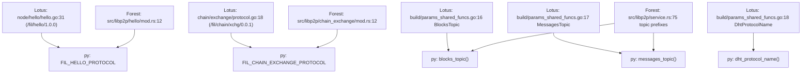
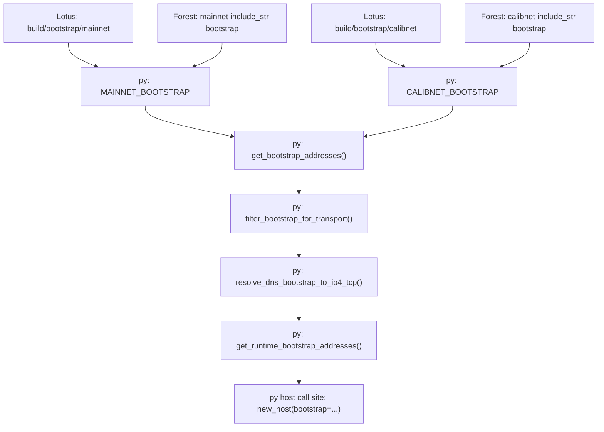
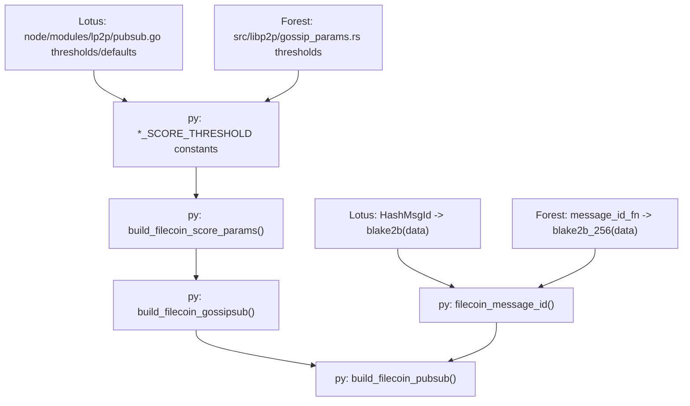

# Lotus/Forest libp2p Dependency Tree for Filecoin DX (Manual V1)

## Corpus and method

- **Pinned parity corpus**:
  - Lotus `v1.35.0` (reference snapshot).
  - Forest `0.32.2` (reference snapshot).
  - py-libp2p Filecoin DX implementation.
- **Method**: manual, evidence-backed lineage mapping from upstream definitions and
  configurations to `libp2p.filecoin` symbols.
- **Citation format**:
  - `project:path:line`.
  - For Lotus/Forest, lines refer to the pinned source snapshots shared in this
    and used as the parity baseline.

## Concern 1: Protocol constants (`hello`, `chain exchange`)

| symbol                        | source project | file:line                             | role                                               |
| ----------------------------- | -------------- | ------------------------------------- | -------------------------------------------------- |
| `FIL_HELLO_PROTOCOL`          | py-libp2p      | `libp2p/filecoin/constants.py:8`      | Filecoin DX exported protocol ID                   |
| `FIL_CHAIN_EXCHANGE_PROTOCOL` | py-libp2p      | `libp2p/filecoin/constants.py:9`      | Filecoin DX exported protocol ID                   |
| `hello protocol`              | Lotus          | `node/hello/hello.go:31`              | Upstream protocol constant `/fil/hello/1.0.0`      |
| `hello protocol`              | Forest         | `src/libp2p/hello/mod.rs:12`          | Upstream protocol constant `/fil/hello/1.0.0`      |
| `chain exchange protocol`     | Lotus          | `chain/exchange/protocol.go:18`       | Upstream protocol constant `/fil/chain/xchg/0.0.1` |
| `chain exchange protocol`     | Forest         | `src/libp2p/chain_exchange/mod.rs:12` | Upstream protocol constant `/fil/chain/xchg/0.0.1` |

## Concern 2: Topic builders (`blocks`, `messages`, `dht`)

| symbol                              | source project | file:line                         | role                            |
| ----------------------------------- | -------------- | --------------------------------- | ------------------------------- |
| `blocks_topic`                      | py-libp2p      | `libp2p/filecoin/constants.py:22` | DX topic helper                 |
| `messages_topic`                    | py-libp2p      | `libp2p/filecoin/constants.py:26` | DX topic helper                 |
| `dht_protocol_name`                 | py-libp2p      | `libp2p/filecoin/constants.py:30` | DX DHT helper                   |
| `BlocksTopic`                       | Lotus          | `build/params_shared_funcs.go:16` | Upstream topic string builder   |
| `MessagesTopic`                     | Lotus          | `build/params_shared_funcs.go:17` | Upstream topic string builder   |
| `DhtProtocolName`                   | Lotus          | `build/params_shared_funcs.go:18` | Upstream DHT protocol builder   |
| `PUBSUB_BLOCK_STR`/`PUBSUB_MSG_STR` | Forest         | `src/libp2p/service.rs:75`        | Upstream topic prefix constants |

## Concern 3: Network name mapping and bootstrap source lists

| symbol                                   | source project | file:line                                    | role                             |
| ---------------------------------------- | -------------- | -------------------------------------------- | -------------------------------- |
| `get_network_preset`                     | py-libp2p      | `libp2p/filecoin/networks.py:49`             | Alias to genesis network mapping |
| `MAINNET_BOOTSTRAP`                      | py-libp2p      | `libp2p/filecoin/networks.py:16`             | Canonical bootstrap list         |
| `CALIBNET_BOOTSTRAP`                     | py-libp2p      | `libp2p/filecoin/networks.py:27`             | Canonical bootstrap list         |
| mainnet genesis name (`testnetnet`)      | Lotus          | `node/modules/chain.go:128`                  | Genesis network name             |
| calibnet genesis name (`calibrationnet`) | Lotus          | `build/buildconstants/params_calibnet.go:27` | Genesis network name             |
| mainnet genesis name (`testnetnet`)      | Forest         | `src/networks/mainnet/mod.rs:26`             | `NETWORK_GENESIS_NAME`           |
| calibnet genesis name (`calibrationnet`) | Forest         | `src/networks/calibnet/mod.rs:24`            | `NETWORK_GENESIS_NAME`           |
| mainnet bootstrap file                   | Lotus          | `build/bootstrap/mainnet:1`                  | Canonical bootstrap source       |
| calibnet bootstrap file                  | Lotus          | `build/bootstrap/calibnet:1`                 | Canonical bootstrap source       |
| mainnet bootstrap include                | Forest         | `src/networks/mainnet/mod.rs:37`             | Include bootstrap payload        |
| calibnet bootstrap include               | Forest         | `src/networks/calibnet/mod.rs:33`            | Include bootstrap payload        |

## Concern 4: Runtime bootstrap path handling

| symbol                             | source project | file:line                                                 | role                                         |
| ---------------------------------- | -------------- | --------------------------------------------------------- | -------------------------------------------- |
| `get_bootstrap_addresses`          | py-libp2p      | `libp2p/filecoin/bootstrap.py:42`                         | Canonical/runtime selection                  |
| `filter_bootstrap_for_transport`   | py-libp2p      | `libp2p/filecoin/bootstrap.py:48`                         | Runtime transport compatibility filter       |
| `resolve_dns_bootstrap_to_ip4_tcp` | py-libp2p      | `libp2p/filecoin/bootstrap.py:79`                         | DNS-to-ip4/tcp runtime conversion            |
| `get_runtime_bootstrap_addresses`  | py-libp2p      | `libp2p/filecoin/bootstrap.py:122`                        | Practical feed for `new_host(bootstrap=...)` |
| bootstrap address config surface   | Lotus          | `node/config/types.go:Libp2p.BootstrapPeers`              | Runtime bootstrap configuration surface      |
| bootstrap dialing surface          | Forest         | `src/libp2p/service.rs:dial_to_bootstrap_peers_if_needed` | Runtime re-dial behavior                     |

## Concern 5: GossipSub score thresholds and mesh defaults

| symbol                                                 | source project | file:line                         | role                             |
| ------------------------------------------------------ | -------------- | --------------------------------- | -------------------------------- |
| `GOSSIP_SCORE_THRESHOLD` etc.                          | py-libp2p      | `libp2p/filecoin/constants.py:15` | Threshold constants exported     |
| `build_filecoin_score_params`                          | py-libp2p      | `libp2p/filecoin/pubsub.py:64`    | Score params constructor         |
| `build_filecoin_gossipsub`                             | py-libp2p      | `libp2p/filecoin/pubsub.py:78`    | Mesh defaults/preset constructor |
| score threshold constants                              | Lotus          | `node/modules/lp2p/pubsub.go:31`  | `-500/-1000/-2500/1000/3.5`      |
| mesh defaults (`D=8`, `Dlo=6`, `Dhi=12`, `history=10`) | Lotus          | `node/modules/lp2p/pubsub.go:24`  | GossipSub overlay defaults       |
| score threshold constants                              | Forest         | `src/libp2p/gossip_params.rs:125` | `build_peer_score_threshold`     |
| topic score references                                 | Forest         | `src/libp2p/gossip_params.rs:17`  | `build_*_topic_config`           |

## Concern 6: Message ID function

| symbol                                    | source project | file:line                         | role                        |
| ----------------------------------------- | -------------- | --------------------------------- | --------------------------- |
| `filecoin_message_id`                     | py-libp2p      | `libp2p/filecoin/constants.py:34` | `blake2b-256(msg.data)`     |
| `HashMsgId`                               | Lotus          | `node/modules/lp2p/pubsub.go:429` | `blake2b.Sum256(m.Data)`    |
| `message_id_fn` (`blake2b_256(msg.data)`) | Forest         | `src/libp2p/behaviour.rs:79`      | Gossipsub message-id parity |

## Concern 7: Architecture positioning and DX usage boundaries

| symbol                              | source project | file:line                                      | role                                             |
| ----------------------------------- | -------------- | ---------------------------------------------- | ------------------------------------------------ |
| `filecoin_architecture_positioning` | py-libp2p      | `docs/filecoin_architecture_positioning.rst:1` | Explains fit and limits of py-libp2p in Filecoin |
| mainnet network-name source         | Lotus          | `node/modules/chain.go:128`                    | Grounds alias/genesis naming discussion          |
| calibnet network-name source        | Lotus          | `build/buildconstants/params_calibnet.go:27`   | Grounds calibnet genesis naming discussion       |
| hello protocol source               | Lotus          | `node/hello/hello.go:31`                       | Grounds protocol compatibility narrative         |
| chain exchange source               | Lotus          | `chain/exchange/protocol.go:18`                | Grounds protocol compatibility narrative         |
| network genesis name source         | Forest         | `src/networks/mainnet/mod.rs:26`               | Cross-client parity support                      |

## Constants lineage tree

## Runtime bootstrap flow tree

## Pubsub preset / score lineage tree

## Divergences and source-of-truth decisions

1. **DHT protocol textual spec vs pinned implementation**

   - Textual Filecoin spec is often cited as `fil/<network-name>/kad/1.0.0`.
   - Pinned Lotus implementation snapshot uses `/fil/kad/<network-name>` in
     `build/params_shared_funcs.go:18`.
   - **Chosen default**: align to pinned Lotus/Forest parity corpus
     for `dht_protocol_name`.
   - **Risk/impact**: if maintainers later prefer textual-spec conformance, this
     helper can be versioned or toggled without touching unrelated DX surfaces.

1. **Score-model fidelity**

   - Upstream clients have richer topic-aware scoring details.
   - Current py-libp2p scorer is intentionally constrained in this implementation.
   - **Chosen default**: `thresholds_only` runtime mode with full upstream reference
     values preserved as static reference dictionaries.

## Completeness checkpoint

- All public exports from `libp2p.filecoin.__all__` have nodes in the curated graph
  artifact (`artifacts/filecoin/libp2p_dependency_tree.v1.json`).
- Required concerns are represented in:
  - this dependency tree document,
  - the parity matrix,
  - and the machine-readable graph.
