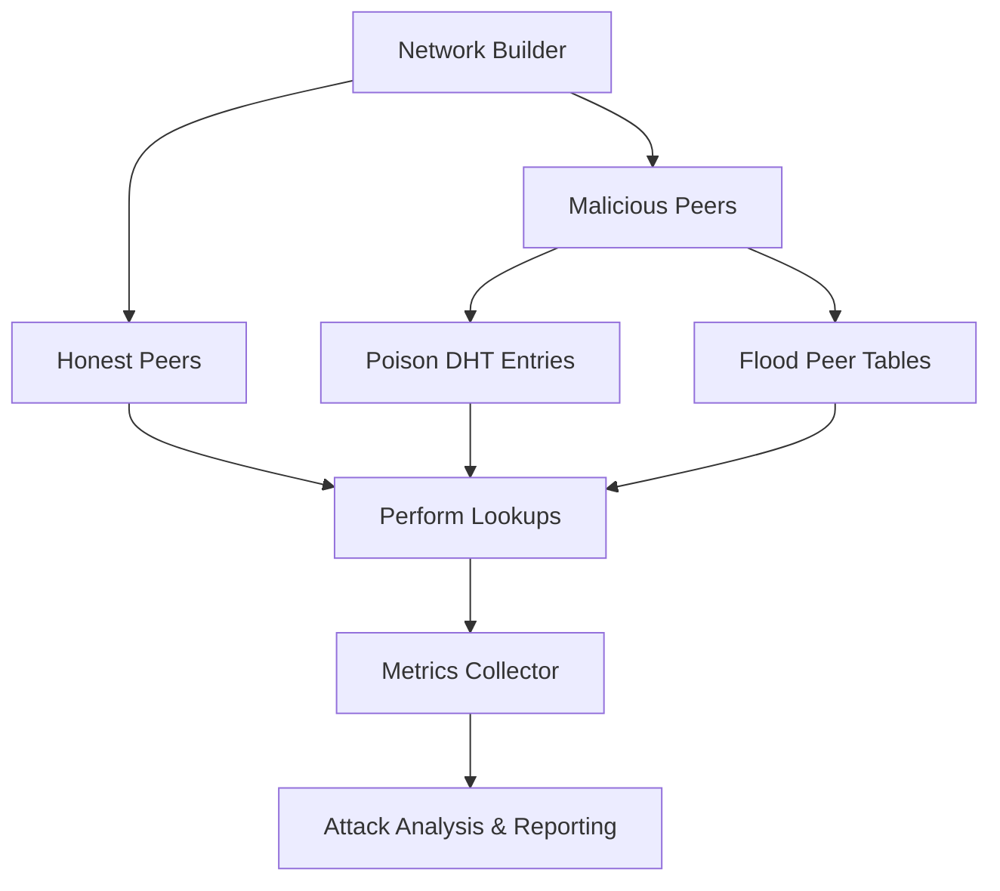

# Network Attack Simulation Module (py-libp2p)

This module provides a **network attack simulation framework** for py-libp2p, focused on testing **P2P network security**. It is implemented as a **submodule** inside py-libp2p to simulate attacks, measure metrics, and analyze network resilience.

______________________________________________________________________

## Table of Contents

1. [Module Overview](#module-overview)
1. [Module Structure](#module-structure)
1. [Setup and Usage](#setup-and-usage)
1. [Testing](#testing)
1. [Implementation Details](#implementation-details)
1. [Metrics and Analysis](#metrics-and-analysis)
1. [Roadmap](#roadmap)
1. [Eclipse Attack Flow](#eclipse-attack-flow)
1. [Contributing](#contributing)

______________________________________________________________________

## Module Overview

This module simulates network attacks in a controlled py-libp2p environment. Current focus:

- **Eclipse attacks** by poisoning DHTs
- Metrics collection for network health and attack effectiveness
- Configurable attack scenarios and network topologies
- Foundation for future attack types (Sybil, flooding, protocol exploits)

All work is **local in py-libp2p** with a planned migration path to `libp2p/interop`.

______________________________________________________________________

## Module Structure

```
tests/security/attack_simulation/
├── eclipse_attack/
│   ├── test_eclipse_simulation.py      # Main test suite for Eclipse attacks
│   ├── malicious_peer.py               # Malicious peer behavior implementation
│   ├── metrics_collector.py            # Collects attack metrics during simulation
│   ├── attack_scenarios.py             # Defines Eclipse attack scenarios
│   └── network_builder.py              # Builds test networks with honest/malicious nodes
├── utils/
│   ├── attack_metrics.py               # Metrics calculation utilities
│   ├── peer_behavior_simulator.py      # Simulates peer behaviors (honest and malicious)
│   └── network_monitor.py              # Monitors network state and connectivity
├── config/
│   ├── attack_configs.py               # Configuration options for attacks
│   └── network_topologies.py           # Predefined network topologies
└── README.md                           # Module documentation and usage guide
```

______________________________________________________________________

## Setup and Usage

1. **Activate py-libp2p virtual environment**:

```bash
source .venv/bin/activate
```

2. **Run the test suite (pytest + trio) in one command**:

```bash
pytest -v tests/security/attack_simulation
```

> All tests validate network setup, malicious peer behavior, and metrics collection.

______________________________________________________________________

## Testing

The module uses **pytest** integrated with **trio**. Test coverage includes:

- Eclipse attack tests (`eclipse_attack/test_eclipse_simulation.py`)
- Utilities: metrics, network monitoring, peer behavior

Passing tests confirm:

- Initial network setup works
- Malicious peer behaviors execute correctly
- Metrics collection framework operates properly

______________________________________________________________________

## Implementation Details

### Malicious Peer

```python
class MaliciousPeer:
    """Simulates malicious peer behavior"""
```

### Network Builder

```python
class AttackNetworkBuilder:
    """Constructs configurable test networks for attack simulations"""
```

______________________________________________________________________

## Metrics and Analysis

Tracked metrics:

- DHT lookup success/failure rates
- Peer table contamination
- Network connectivity
- Attack effectiveness and recovery metrics

```python
class AttackMetrics:
    """Metrics collection and analysis framework"""
```

______________________________________________________________________

## Roadmap

**Phase 1 (Current)**: Eclipse attack simulation

**Phase 2**: Extended attacks (Sybil, flooding, connection exhaustion)

**Phase 3**: Cross-implementation testing in `libp2p/interop`

______________________________________________________________________

## Eclipse Attack Flow



> This flow illustrates the lifecycle of an Eclipse attack: the network is built, malicious peers poison the DHT and flood peer tables, honest peers perform lookups, and metrics are collected and analyzed.

______________________________________________________________________

## Contributing

1. Add new Eclipse attack scenarios under eclipse_attack, and shared utilities for any attack under utils.
1. Implement new metrics or monitoring tools
1. Write corresponding pytest tests
1. Submit PR to py-libp2p for review
