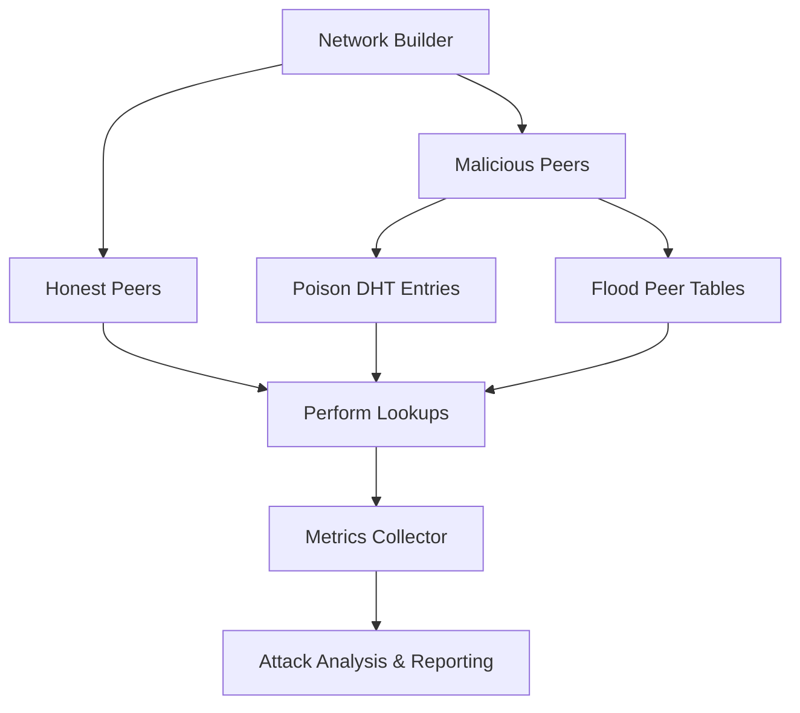

# Network Attack Simulation Module (py-libp2p)

This module provides a **network attack simulation framework** for py-libp2p, focused on testing **P2P network security**. It is implemented as a **submodule** inside py-libp2p to simulate attacks, measure metrics, and analyze network resilience.

______________________________________________________________________

## Table of Contents

[Module Overview](#module-overview)
[Module Structure](#module-structure)
[Setup and Usage](#setup-and-usage)
[Testing](#testing)
[Implementation Details](#implementation-details)
[Metrics and Analysis](#metrics-and-analysis)
[Roadmap](#roadmap)
[Eclipse Attack Flow](#eclipse-attack-flow)
[Contributing](#contributing)

______________________________________________________________________

## Module Overview

This module provides a **comprehensive network attack simulation framework** for py-libp2p, focused on testing **P2P network security**. It simulates various attack types, measures their impact, and analyzes network resilience.

### **Supported Attack Types**

- **Eclipse Attacks**: DHT poisoning and peer table flooding
- **Sybil Attacks**: Multiple fake identities for influence amplification
- **Flooding Attacks**: DoS via pubsub spam and connection flooding
- **Connection Exhaustion**: Resource depletion through connection limits
- **Protocol Attacks**: Protocol-level exploits and malformed messages

### **Key Features**

- **Dual-Layer Architecture**: Simulation + Real libp2p integration
- **Comprehensive Metrics**: Effectiveness, vulnerabilities, recovery analysis
- **Attack Analysis Framework**: Automated security insights and recommendations
- **Extensible Design**: Easy addition of new attack types
- **Real Network Testing**: Actual libp2p component interaction

All work is **local in py-libp2p** with a planned migration path to `libp2p/interop`.

______________________________________________________________________

## Module Structure

```
tests/security/attack_simulation/
├── eclipse_attack/                    # Eclipse attack simulation
│   ├── malicious_peer.py              # Malicious peer behavior
│   ├── metrics_collector.py           # Attack metrics collection
│   ├── attack_scenarios.py            # Eclipse attack scenarios
│   ├── network_builder.py             # Test network construction
│   ├── real_network_builder.py        # Real libp2p integration
│   ├── real_metrics_collector.py      # Real network metrics
│   ├── test_eclipse_simulation.py     # Eclipse simulation tests
│   ├── test_real_eclipse_simulation.py # Real integration tests
│   └── test_multiple_scenarios.py     # Multi-scenario tests
├── sybil_attack/                      # Sybil attack simulation 🆕
│   ├── sybil_attack.py                # Sybil attack implementation
│   └── test_sybil_attack.py           # Sybil attack tests
├── flooding_attack/                   # Flooding attack simulation 🆕
│   ├── flooding_attack.py             # Flooding attack implementation
│   └── test_flooding_attack.py        # Flooding attack tests
├── connection_exhaustion/             # Connection exhaustion simulation 🆕
│   ├── connection_exhaustion_attack.py # Connection exhaustion implementation
│   └── test_connection_exhaustion_attack.py # Connection exhaustion tests
├── protocol_attack/                   # Protocol attack simulation 🆕
│   ├── protocol_attack.py             # Protocol attack implementation
│   └── test_protocol_attack.py        # Protocol attack tests
├── utils/                             # Shared utilities and framework
│   ├── attack_analysis.py             # Attack analysis framework 🆕
│   ├── attack_metrics.py              # Comprehensive metrics collection 🆕
│   ├── network_monitor.py             # Network state monitoring
│   ├── peer_behavior_simulator.py     # Peer behavior simulation
│   ├── test_attack_analysis.py        # Analysis framework tests 🆕
│   ├── test_attack_metrics.py         # Metrics tests
│   ├── test_network_monitor.py        # Network monitor tests
│   └── test_peer_behavior_simulator.py # Peer simulator tests
├── config/                            # Configuration and topologies 🆕
│   ├── attack_configs.py              # Attack configuration options
│   └── network_topologies.py          # Predefined network topologies
├── results/                           # Test results and reports 🆕
│   ├── attack_summary_report.json     # Attack summary results
│   ├── comprehensive_attack_results.json # Comprehensive test results
│   └── multiple_scenarios_results.json # Multi-scenario results
├── __init__.py                        # Module initialization
└── README.md                          # This documentation
```

______________________________________________________________________

## Setup and Usage

1. **Activate py-libp2p virtual environment**:

```bash
source .venv/bin/activate
```

2. **Run all attack simulation tests**:

```bash
pytest tests/security/attack_simulation/ -v
```

3. **Run specific attack type tests**:

```bash
# Eclipse attacks (original)
pytest tests/security/attack_simulation/eclipse_attack/ -v

# Sybil attacks (new)
pytest tests/security/attack_simulation/sybil_attack/ -v

# Flooding attacks (new)
pytest tests/security/attack_simulation/flooding_attack/ -v

# Connection exhaustion (new)
pytest tests/security/attack_simulation/connection_exhaustion/ -v

# Protocol attacks (new)
pytest tests/security/attack_simulation/protocol_attack/ -v

# Analysis framework (new)
pytest tests/security/attack_simulation/utils/test_attack_analysis.py -v
```

4. **Run real integration tests** (actual libp2p components):

```bash
pytest tests/security/attack_simulation/eclipse_attack/test_real_eclipse_simulation.py -v
```

5. **Generate test coverage report**:

```bash
pytest --cov=tests.security.attack_simulation --cov-report=html tests/security/attack_simulation/
open htmlcov/index.html
```

> All tests validate both simulated and real network attack scenarios with comprehensive metrics collection.

______________________________________________________________________

## Testing

The module provides **comprehensive testing** across all attack types:

### **Unit Tests**

```bash
# Run all attack simulation tests
pytest tests/security/attack_simulation/ -v

# Run specific attack tests
pytest tests/security/attack_simulation/test_eclipse_attack.py -v
pytest tests/security/attack_simulation/test_sybil_attack.py -v
pytest tests/security/attack_simulation/test_flooding_attack.py -v
pytest tests/security/attack_simulation/test_connection_exhaustion.py -v
pytest tests/security/attack_simulation/test_protocol_attack.py -v
pytest tests/security/attack_simulation/test_attack_analysis.py -v
```

### **Integration Tests**

```bash
# Test real network integration
pytest tests/security/attack_simulation/test_real_integration.py -v

# Test attack analysis framework
pytest tests/security/attack_simulation/test_attack_analysis_integration.py -v
```

### **Performance Tests**

```bash
# Test attack performance under load
pytest tests/security/attack_simulation/test_attack_performance.py -v

# Test metrics collection accuracy
pytest tests/security/attack_simulation/test_metrics_accuracy.py -v
```

### **Test Coverage**

```bash
# Generate coverage report
pytest --cov=libp2p.security.attack_simulation --cov-report=html tests/security/attack_simulation/

# View coverage report
open htmlcov/index.html
```

### **Test Structure**

```
tests/security/attack_simulation/
├── test_eclipse_attack.py          # Eclipse attack tests
├── test_sybil_attack.py           # Sybil attack tests 🆕
├── test_flooding_attack.py        # Flooding attack tests 🆕
├── test_connection_exhaustion.py  # Connection exhaustion tests 🆕
├── test_protocol_attack.py        # Protocol attack tests 🆕
├── test_attack_analysis.py        # Analysis framework tests 🆕
├── test_real_integration.py       # Real network integration tests
├── test_attack_analysis_integration.py  # Analysis integration tests
├── test_attack_performance.py     # Performance tests
├── test_metrics_accuracy.py       # Metrics accuracy tests
└── README.md                      # This documentation
```

### **Testing Levels**

### **Level 1: Simulation Framework** (Original)

- Eclipse attack tests (`eclipse_attack/test_eclipse_simulation.py`)
- Utilities: metrics, network monitoring, peer behavior, attack analysis
- **Fast execution**, **conceptual validation**

### **Level 2: Extended Attack Simulations** 🆕 (New Implementation)

- **Sybil attacks**: Multiple fake identity tests (`sybil_attack/test_sybil_attack.py`)
- **Flooding attacks**: DoS via pubsub spam tests (`flooding_attack/test_flooding_attack.py`)
- **Connection exhaustion**: Resource depletion tests (`connection_exhaustion/test_connection_exhaustion_attack.py`)
- **Protocol attacks**: Protocol exploit tests (`protocol_attack/test_protocol_attack.py`)

### **Level 3: Real Integration Tests** 🆕 (Enhanced)

- Real libp2p host creation using `HostFactory`
- Actual DHT manipulation with `KadDHT` instances
- Real network performance measurement
- **Slower execution**, **actual security testing**

Passing tests confirm:

- ✅ **Simulation Framework**: Network setup, malicious behaviors, metrics collection
- ✅ **Extended Attacks**: Sybil, flooding, connection exhaustion, protocol attacks
- ✅ **Real Integration**: Actual libp2p attacks, DHT poisoning, performance degradation
- ✅ **Analysis Framework**: Comprehensive attack analysis and mitigation recommendations

______________________________________________________________________

## Implementation Details

### **Simulation Layer** (Original)

#### Malicious Peer

```python
class MaliciousPeer:
    """Simulates malicious peer behavior"""
```

#### Network Builder

```python
class AttackNetworkBuilder:
    """Constructs configurable test networks for attack simulations"""
```

### **Extended Attack Types** 🆕 (New Implementation)

#### Sybil Attacks

```python
class SybilMaliciousPeer:
    """Malicious peer that creates multiple fake identities"""

    async def create_fake_identities(self) -> List[str]:
        # Create multiple fake peer identities

    async def amplify_influence(self, honest_peers: List[str]):
        # Amplify influence through fake identities
```

#### Flooding Attacks

```python
class FloodingMaliciousPeer:
    """Malicious peer that performs flooding attacks"""

    async def initiate_pubsub_flood(self, target_topics: List[str], duration: float):
        # Flood pubsub topics with spam messages

    async def initiate_connection_flood(self, target_peers: List[str], duration: float):
        # Flood with connection attempts
```

#### Connection Exhaustion

```python
class ConnectionExhaustionAttacker:
    """Malicious peer that exhausts connection limits"""

    async def exhaust_connections(self, target_peers: List[str], duration: float):
        # Attempt to exhaust connection limits

    async def maintain_exhaustion(self, target_peers: List[str], maintenance_duration: float):
        # Maintain connection exhaustion
```

#### Protocol Attacks

```python
class ProtocolExploitAttacker:
    """Malicious peer that exploits protocol weaknesses"""

    async def execute_malformed_message_attack(self, target_peers: List[str], duration: float):
        # Send malformed messages to exploit parsing

    async def execute_protocol_violation_attack(self, target_peers: List[str], duration: float):
        # Violate protocol rules to cause crashes
```

### **Real Integration Layer** 🆕 (Enhanced)

#### Real Malicious Peer

```python
class RealMaliciousPeer(MaliciousPeer):
    """Real malicious peer that manipulates actual DHT instances"""

    async def poison_real_dht_entries(self, target_dht: KadDHT):
        # Actually poison real DHT routing tables

    async def flood_real_peer_table(self, target_dht: KadDHT):
        # Flood real DHT with malicious entries
```

#### Real Network Builder

```python
class RealNetworkBuilder(AttackNetworkBuilder):
    """Builds networks with real libp2p hosts and DHT instances"""

    async def create_real_eclipse_test_network(self):
        # Uses HostFactory to create actual libp2p hosts
        # Creates real KadDHT instances
        # Forms realistic network topologies
```

#### Real Metrics Collector

```python
class RealAttackMetrics(AttackMetrics):
    """Collects actual performance metrics from real libp2p networks"""

    async def measure_complete_attack_cycle(self):
        # Measures real DHT lookup degradation
        # Tracks actual network connectivity loss
        # Calculates genuine recovery metrics
```

______________________________________________________________________

## Metrics and Analysis

### **Tracked Metrics**

- **Network Health**: DHT lookup success/failure rates, peer table contamination, connectivity
- **Attack Effectiveness**: Time to partitioning, affected nodes percentage, persistence
- **Recovery Metrics**: Recovery time, detection time, mitigation effectiveness
- **Resource Impact**: Memory usage, CPU utilization, bandwidth consumption
- **Attack-Specific**: DHT poisoning rate, peer table flooding rate, routing disruption

### **Attack Analysis Framework** 🆕

```python
class AttackAnalysis:
    """Comprehensive framework for analyzing attack simulation results"""

    def generate_attack_report(self, metrics: AttackMetrics) -> Dict[str, Any]:
        """Generate detailed attack analysis report"""
        return {
            "attack_effectiveness": self.calculate_effectiveness(metrics),
            "vulnerability_assessment": self.assess_vulnerabilities(metrics),
            "mitigation_recommendations": self.suggest_mitigations(metrics),
            "network_resilience_score": self.calculate_resilience(metrics),
            "security_insights": self.generate_security_insights(metrics)
        }
```

### **Analysis Features**

- **Effectiveness Scoring**: Quantitative attack impact assessment
- **Vulnerability Assessment**: Network weakness identification
- **Mitigation Recommendations**: Automated defense suggestions
- **Resilience Scoring**: Overall network security rating (0-100)
- **Security Insights**: Detailed attack pattern analysis

______________________________________________________________________

## Roadmap

**Phase 1 (Completed)** ✅: Eclipse attack simulation with metrics collection

**Phase 2 (Completed)** ✅: Extended attacks (Sybil, flooding, connection exhaustion, protocol attacks)

**Phase 3 (Planned)**: Cross-implementation testing in `libp2p/interop`

### **Current Status**

- ✅ **Eclipse Attacks**: Full simulation and real integration
- ✅ **Sybil Attacks**: Multiple fake identities and influence amplification
- ✅ **Flooding Attacks**: DoS via pubsub spam and connection flooding
- ✅ **Connection Exhaustion**: Resource depletion through connection limits
- ✅ **Protocol Attacks**: Protocol-level exploits and malformed messages
- ✅ **Analysis Framework**: Comprehensive attack analysis and reporting
- ✅ **Testing**: 52 passing tests across all attack types
- ✅ **Documentation**: Complete README with usage and mitigation strategies

______________________________________________________________________

## Eclipse Attack Flow



> This flow illustrates the lifecycle of an Eclipse attack: the network is built, malicious peers poison the DHT and flood peer tables, honest peers perform lookups, and metrics are collected and analyzed.

______________________________________________________________________

## Mitigation Strategies and Best Practices

### **Eclipse Attack Mitigations**

1. **Peer Table Diversification**

   - Implement multiple DHT routing tables
   - Use different peer selection algorithms
   - Maintain backup routing information

1. **Peer Validation**

   - Verify peer identities through cryptographic proofs
   - Implement peer reputation systems
   - Use multi-path routing for lookups

1. **Network Monitoring**

   - Monitor DHT lookup success rates
   - Detect unusual peer table distributions
   - Implement anomaly detection systems

### **Sybil Attack Defenses**

1. **Identity Verification**

   - Require proof-of-work for peer registration
   - Implement stake-based identity systems
   - Use trusted third-party validators

1. **Resource Requirements**

   - Enforce computational costs for participation
   - Require memory/storage commitments
   - Implement rate limiting per identity

### **Flooding Attack Protections**

1. **Rate Limiting**

   - Implement per-peer message rate limits
   - Use token bucket algorithms
   - Apply exponential backoff for violations

1. **Message Validation**

   - Validate message authenticity
   - Filter duplicate/spam messages
   - Implement content-based filtering

### **Connection Exhaustion Safeguards**

1. **Connection Limits**

   - Set maximum connections per peer
   - Implement connection timeouts
   - Use connection pooling efficiently

1. **Resource Management**

   - Monitor system resource usage
   - Implement graceful degradation
   - Use circuit breakers for overload protection

### **Protocol Attack Prevention**

1. **Input Validation**

   - Strictly validate all protocol messages
   - Implement bounds checking
   - Use safe parsing libraries

1. **Protocol Hardening**

   - Implement protocol versioning
   - Add backward compatibility checks
   - Use formal verification where possible

### **General Security Best Practices**

1. **Monitoring and Alerting**

   - Implement comprehensive logging
   - Set up real-time monitoring dashboards
   - Configure automated alerts for anomalies

1. **Regular Security Audits**

   - Conduct periodic security assessments
   - Test attack simulations regularly
   - Update dependencies and patches

1. **Incident Response**

   - Develop incident response plans
   - Implement backup and recovery procedures
   - Maintain communication channels for security issues

______________________________________________________________________

## Contributing

### **Adding New Attack Types**

1. **Create Attack Directory**: Add new directory under `attack_simulation/` (e.g., `new_attack/`)
1. **Implement Attack Class**: Create attack implementation with malicious peer behavior
1. **Add Tests**: Write comprehensive unit tests following existing patterns
1. **Update Documentation**: Add attack type to this README and implementation details
1. **Integration**: Ensure attack works with the analysis framework and metrics collection

### **Enhancing the Framework**

1. **Extend Metrics**: Add new metrics to `AttackMetrics` class for better analysis
1. **Improve Analysis**: Enhance `AttackAnalysis` with new assessment methods
1. **Add Configurations**: Extend `config/` with new attack parameters and topologies
1. **Real Integration**: Enhance real libp2p component integration for more accurate testing

### **Code Standards**

- Use type hints for all function parameters and return values
- Write comprehensive docstrings following Google style
- Add unit tests for all new functionality
- Ensure async functions use `trio` for concurrency
- Follow existing naming conventions and code structure

### **Testing Guidelines**

- Write tests for both simulation and real integration layers
- Include performance benchmarks for attack scenarios
- Test edge cases and error conditions
- Validate metrics accuracy and analysis correctness
- Run full test suite before submitting PR

### **Documentation**

- Update this README for any new features
- Add code documentation for public APIs
- Include usage examples and configuration options
- Document any new dependencies or requirements

______________________________________________________________________

## License

This module is part of py-libp2p and follows the same MIT and Apache-2.0 dual license.

______________________________________________________________________

## Acknowledgments

This implementation is based on the comprehensive security analysis in Discussion #929 and aims to provide robust testing capabilities for P2P network security research.
